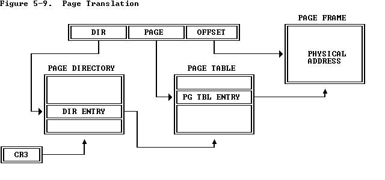

# MMU Design Ideas

This file documents my ideas for the design of an MMU for SwiVM
in Verilog.

## Existing Memory Device

At present (mid-Aug 2019) there is a non-paging
memory device with this interface:

```
  input         i_clk,          // Memory updated on rising edge
  input  [15:0] i_addr,         // Memory address
  input  [31:0] i_data,         // Input data
  input  [1:0]  i_size,         // Size of data to access
  input         i_we,           // Write-enable, active low
  output [31:0] o_data          // Output data
```

The output data becomes available one clock tick after the input address
changes. I want to keep this device for now, and put the MMU in between
the CPU and memory device.

## The MMU in `em.c`

The `em.c` system emulator implements an MMU. The code is fairly opaque
and it's sequential, so I don't want to "convert" the MMU code from C
into Verilog. But here's the architectural details.

The MMU is a two-level design, so each virtual address is used thus:

 + Bottom 12 bits are the offset into a page. Pages are 4K in size.
 + Next 10 bits are the page number in a page table. There are 1,024
   4-byte page entries in a page table.
 + Top 10 bits  are the page table number in a page directory.
   There are 1,024 4-byte page table entries in a page directory.

In a page table entry, these bits indicate the state of the page:

```
  PTE_P = 0x001,                // Present
  PTE_W = 0x002,                // Writeable
  PTE_U = 0x004,                // User mode
  PTE_A = 0x020,                // Accessed
  PTE_D = 0x040,                // Dirty
```

It's very similar to the *i386* MMU structure:



except that the status bits on each page are different, and
the Swieros VM doesn't have a CR3 register.


## Proposed MMU and Its Interface

I need to implement the same sort of operations on page table entries that
the existing `em.c` has. To begin with, I won't have any cache; this means
that it might be multiple clock cycles before the data at a virtual address
is written or fetched through the MMU. Here's my proposal so far (mid-Aug 2019).

The MMU to memory interface will be the existing memory interface as shown above.

The CPU to MMU interface will be something like this:

```
  input         i_clk,          // Action performed on rising edge
  input  [31:0] i_vaddr,        // Virtual memory address
  input  [31:0] i_data,         // Input data
  input  [1:0]  i_size,         // Size of data to access
  input  [3:0]  i_cmd,          // Command to perform
  output        i_valid,        // Command is valid
  input         i_user,         // CPU is in user mode
  output [31:0] o_data,         // Output data
  output        o_valid,        // Command has completed
  output [3:0]  o_error         // Error result of the command
```

The MMU is given a command to perform, plus some optional data and the data's size:
byte, halfword, word. There is an address associated with this data. The MMU takes
one or more clock cycles to perform this command. When completed, the *o_valid*
line rises for one clock cycle. During this time, any output data and error are
valid.

The page numbers in both the page directory and the page tables are physical
values. This is done so that we can send them directly to the memory device.
If the numbers were virtual, the MMU would have to recursively send them to 
itself to convert them to physical values.

## Possible Commands

Based on `em.c`, here are the commands that I see we will need:

```
  MMU_READ=   4'h0;		// Read from a virtual address
  MMU_WRITE=  4'h1;		// Write to a virtual address
  MMU_SPAG=   4'h2;		// Enable or disable paging
  MMU_PDIR=   4'h3;		// Set the page directory address
```

Here are the errors to be returned:

```
  MMU_NOERR=   4'h0;                       // No error
  MMU_FWPAGE=  4'h1;                       // Page fault on write
  MMU_FRPAGE=  4'h2;                       // Page fault on read
  MMU_BADCMD=  4'h3;                       // Unrecognised command
  MMU_BADSPAG= 4'h3;                       // Bad SPAG value
```

I've left room for future error values.


## Purpose of the Commands

  + MMU_SPAG - Enable or disable paging. If the lsb of the data is 0, paging is disabled.
    The MMU passes all future *i_vaddr*s directly through to the memory unit.
    If the lsb of the data is 0, paging is enabled. All future *i_vaddr*s are mapped by
    the MMU to a physical address which is then passed to the memory unit.
  + MMU_PDIR - Set the page directory address. The *i_vaddr* is treated as a physical
    address, and the MMU stores this as the base address of the page directory.
    I think I'll zero the bottom 12 bits to align the address on a page boundary.
  + MMU_READ - Read from a virtual address. Use the *i_vaddr* to index into the page
    directory to find the page table and then the page entry. Using the *i_user* flag
    and the fact that this is a read, look at the permissions on the page entry. If
    OK, pass the physical page address to the memory unit. If not, return an error.
  + MMU_WRITE - Write a virtual address. Use the *i_vaddr* to index into the page
    directory to find the page table and then the page entry. Using the *i_user* flag
    and the fact that this is a write, look at the permissions on the page entry. If
    OK, pass the physical page address to the memory unit. If not, return an error.

I can't think of any other commands that are needed by the MMU; there isn't any caching,
so we don't need to flush the cache yet. The kernel can map the page directory and
page tables into kernel memory, so it can directly read/write the page entries.

## MMU Finite State Machine

It makes sense to build the MMU as a FSM. Here are the proposed design states so far.
I haven't tried to optimise the design, so right now it will take several clock cycles
to get some commands done.

### RECVCMD - Receive the command

In this state, we are waiting for *i_valid* to rise. The *o_valid* line is set to zero here.
I think this means that a new command can be sent in in the same clock cycle that the
result of the last command is valid.

Latch the command and the other inputs.

Based on the command, move to one of the following states. If the command is not
recognised, set *o_valid* and *o_error* to MMU_BADCMD and move to RECVCMD.

For reads and writes, if paging is set move to GETPDE. Otherwise, move to
READDATA and WRITEDATA.

### SETPAG - Enable or disable paging

Set an internal *ispaging* register to the low bit of *i_data*. Set
*o_valid* and *o_error* to MMU_NOERR and move to RECVCMD.

### SETPDIR - Set the page directory base address

Truncate the *i_vaddr* to a 4K page base. If it's within the known system memory size,
set an internal *pagdir* register to this value, set *o_valid* and *o_error* to MMU_NOERR
and move to RECVCMD. Otherwise, set *o_valid* and *o_error* to MMU_BADSPAG and move to RECVCMD.

### GETPDE - Get an entry from the page directory

Using the top 10 bits of the *i_vaddr* plus the internal *pagdir* value, get the relevant
page directory from the memory device. Move to GETPTE.

### GETPTE - Get an entry from the page table

Using the middle 10 bits of the *i_vaddr* plus the address of the page table, get the
page table entry specific to the requested page. If the command was MMU_READ, move to
READPAGE. If the command was MMU_WRITE, move to WRITEPAGE.

### READPAGE - Read data from a page

Check the PTE_P and PTE_U permissions on the page table entry. If access is permitted,
ask the memory device to read the data from the page frame, and move to SENDDATA. If not,
set *o_valid* and *o_error* to MMU_FRPAGE and move to RECVCMD.

### WRITEPAGE - Write data to a page

Check these PTE_P, PTE_W and PTE_U permissions on the page table entry. If access is permitted,
ask the memory device to write the data to the page frame, and move to SENDDATA. If not,
set *o_valid* and *o_error* to MMU_FWPAGE and move to RECVCMD.

### SENDDATA - Send the data back to the CPU

If a read command, set the PTE_A bit on the page by asking the memory device to rewrite
the page table entry. If a write command, ditto for both the PTE_A and PTE_D bits.
Set *o_valid* and *o_data*, and set *o_error* to MMU_NOERR. Move to RECVCMD.

### READDATA - Non-paging read data

Send the *i_vaddr* directly to the memory device, and a read command. Move to SENDDATA.

### WRITEDATA - Non-paging write data

Send the *i_vaddr* directly to the memory device, and a write command. Move to SENDDATA.
